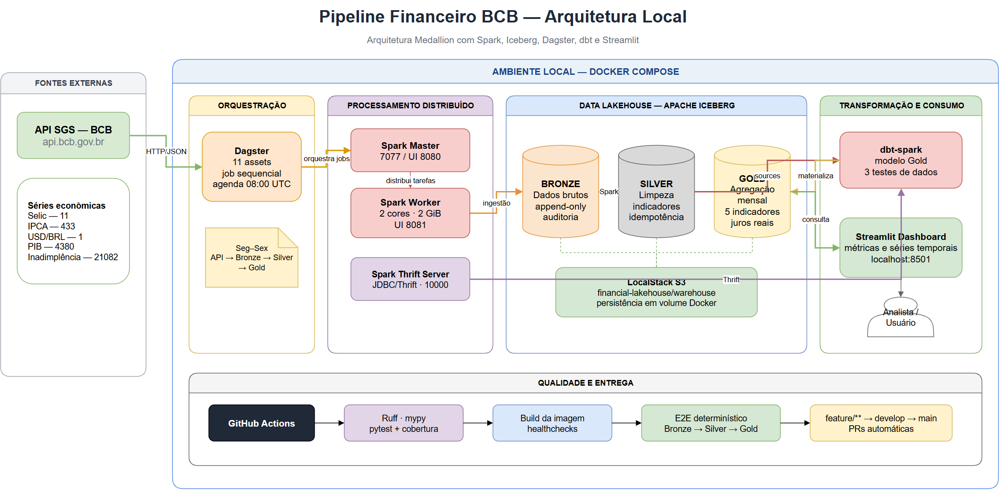

# 📊 Pipeline Financeiro BCB

> Data lakehouse pipeline que ingere séries macroeconômicas do **Banco Central do Brasil** (Selic, IPCA, câmbio USD/BRL), processa em arquitetura medallion (Bronze → Silver → Gold) com **Spark + Apache Iceberg**, orquestra com **Dagster**, agrega com **dbt** e expõe os indicadores em um dashboard **Streamlit**.

Projeto pessoal de portfólio em engenharia de dados — construído para demonstrar um pipeline batch de ponta a ponta com ferramentas do mundo real (não apenas notebooks).

[](https://github.com/ALXAVIER-DEV/pipeline-financeiro-bcb/actions/workflows/ci.yml)
[](https://www.python.org/)
[](https://spark.apache.org/)
[](https://www.docker.com/)

---

## 🎯 Visão de portfólio

Este projeto resolve um cenário realista de Engenharia de Dados: coletar séries
econômicas de uma API pública, preservar o histórico bruto, aplicar regras de
qualidade e enriquecimento, produzir uma camada analítica e disponibilizar os
resultados em um dashboard.

### O que o projeto demonstra

- construção de um pipeline batch completo, da fonte ao consumo;
- arquitetura Medallion com cinco tabelas Bronze, cinco Silver e uma Gold;
- processamento distribuído em cluster Spark;
- tabelas ACID e catálogo lakehouse com Apache Iceberg;
- orquestração declarativa de 11 assets no Dagster;
- modelagem analítica e testes de dados com dbt;
- infraestrutura local reproduzível com Docker Compose;
- qualidade automatizada com Ruff, mypy, pytest e testes end-to-end;
- integração contínua com build da imagem, healthchecks e E2E no GitHub Actions.

### Resultados verificáveis

| Resultado | Evidência |
|---|---|
| 5 séries econômicas integradas | Selic, IPCA, dólar, PIB e inadimplência |
| 11 assets orquestrados | 5 Bronze + 5 Silver + 1 Gold |
| Pipeline reproduzível | Imagem compartilhada e 9 serviços Docker Compose |
| Qualidade de código | Ruff, mypy e 15 testes unitários |
| Qualidade de dados | 3 testes dbt na camada Gold |
| Validação operacional | Smoke test Spark/Iceberg e E2E Bronze → Silver → Gold |
| Entrega contínua | Fluxo automatizado `feature/** → develop → main` |

### Decisões técnicas

- **Iceberg em vez de Parquet isolado:** adiciona transações ACID, evolução de
  schema, particionamento e gerenciamento de tabelas.
- **LocalStack em vez de uma conta cloud:** reproduz a integração com S3 sem
  custo ou dependência de infraestrutura externa.
- **Dagster orientado a assets:** torna explícitas as dependências e a
  observabilidade entre Bronze, Silver e Gold.
- **dbt na Gold:** separa a modelagem analítica SQL do processamento de dados
  realizado pelo Spark.
- **E2E com dados sintéticos:** valida o caminho real do pipeline no CI sem
  tornar os testes dependentes da disponibilidade momentânea da API do BCB.

## 🗺️ Arquitetura



[Abrir diagrama editável no Draw.io](docs/architecture/pipeline-financeiro-bcb.drawio)

```
BCB SGS API  ──►  Bronze (Iceberg, append-only)  ──►  Silver (Iceberg, overwrite por partição)  ──►  Gold (dbt)  ──►  Dashboard (Streamlit)
                         ▲                                      ▲
                         └──────────── orquestrado por Dagster (job diário) ─┘

Armazenamento: Apache Iceberg sobre S3 (LocalStack) via Spark
```

| Camada | Tecnologia | O que faz |
|---|---|---|
| **Bronze** | Spark + Iceberg | Ingestão bruta da API do BCB, append-only, particionado por ano, com metadados de auditoria (`_ingested_at`, `_source`, `_serie`) |
| **Silver** | Spark + Iceberg | Limpeza, enriquecimento e cálculo de indicadores derivados (médias móveis, variações, classificações), sobrescrita idempotente por partição |
| **Gold** | dbt (SQL) | Agregação mensal dos cinco indicadores em uma tabela única para consumo analítico |
| **Orquestração** | Dagster | Assets declarativos + job agendado (dias úteis, 08:00 UTC) |
| **Visualização** | Streamlit | Dashboard com métricas atuais e evolução do juro real estimado |

### Séries do BCB (SGS)

| Série | Código SGS | Frequência | Status |
|---|---|---|---|
| Selic | 11 | Diária | ✅ Bronze → Silver → Gold |
| IPCA | 433 | Mensal | ✅ Bronze → Silver → Gold |
| Dólar (USD/BRL) | 1 | Diária | ✅ Bronze → Silver → Gold |
| PIB | 4380 | Mensal | ✅ Bronze → Silver → Gold |
| Inadimplência | 21082 | Mensal | ✅ Bronze → Silver → Gold |

---

## 🧱 Stack técnica

- **Ingestão**: Python, `requests`, `pandas`, `loguru`
- **Processamento**: Apache Spark 3.5 + Apache Iceberg 1.6 (tabelas ACID, time travel, particionamento)
- **Armazenamento**: S3 (emulado localmente com LocalStack)
- **Transformação analítica**: dbt-core
- **Orquestração**: Dagster (Software-Defined Assets + schedule)
- **Dashboard**: Streamlit
- **Qualidade**: pytest, ruff, mypy, CI no GitHub Actions

---

## 📂 Estrutura do projeto

```
src/
├── ingestion/           # Client da API do BCB + escrita na camada Bronze
│   ├── bcb_client.py       # fetch_bcb_data() — consome a API SGS
│   ├── bronze_writer.py    # writer_bronze() — grava Iceberg + control table
│   └── ingest_bronze.py    # CLI: python -m src.ingestion.ingest_bronze
├── transformation/       # Processadores da camada Silver
│   ├── base_processor.py     # BaseProcessor (template method: transform → create → write)
│   ├── processors/
│   │   ├── selic_processor.py    # variação, taxa anualizada, médias móveis, nível da taxa
│   │   ├── ipca_processor.py     # acumulado 12m, pressão inflacionária
│   │   └── dollar_processor.py   # variação, médias móveis, tendência
│   └── process_silver.py     # CLI: python -m src.transformation.process_silver [serie]
├── orchestration/
│   └── pipeline.py         # Assets e schedule do Dagster
├── dashboard/
│   └── app.py               # Dashboard Streamlit (lê a tabela gold)
└── utils/
    └── spark_session.py     # SparkSession configurada para Iceberg + S3A

dbt/models/gold/
└── indicadores_macroeconomicos.sql   # Agregação mensal (join Selic + IPCA + Dólar)

scripts/
├── check_bronze.py         # Sanity check da camada Bronze
└── check_silver.py         # Sanity check da camada Silver

tests/unit/                 # Testes com pytest + mocks de Spark/requests
infra/                       # docker-compose (LocalStack + Spark), jars do Iceberg, Terraform (scaffold)
```

---

## 🚀 Como rodar localmente

**Pré-requisitos**: Docker, Python 3.11+, Java (para o Spark local)

```bash
# 1. Instalar dependências
make install

# 2. Subir infraestrutura (LocalStack + Spark)
make docker-up
# ou apenas o LocalStack + bucket:
make localstack-up

# 3. Ingerir dados brutos do BCB (Bronze)
python -m src.ingestion.ingest_bronze 30      # últimos 30 dias

# 4. Processar camada Silver
python -m src.transformation.process_silver    # todas as séries
python -m src.transformation.process_silver selic   # uma série específica

# 5. Orquestrar com Dagster (alternativa aos passos 3-4)
dagster dev -f src/orchestration/pipeline.py
# UI em http://localhost:3000

# 6. Rodar o dashboard
streamlit run src/dashboard/app.py
```

### Listar tabelas e consultar os dados

Com o LocalStack ativo e o pipeline já executado, abra uma sessão Python:

```bash
python
```

Inicialize o Spark configurado pelo projeto:

```python
from src.utils.spark_session import get_spark

spark = get_spark("analise-dados")
```

Liste os namespaces e as tabelas disponíveis:

```python
spark.sql("SHOW NAMESPACES IN local").show(truncate=False)
spark.sql("SHOW TABLES IN local.bronze").show(truncate=False)
spark.sql("SHOW TABLES IN local.silver").show(truncate=False)
spark.sql("SHOW TABLES IN local.gold").show(truncate=False)
```

Inspecione a estrutura e os metadados de uma tabela:

```python
spark.sql("DESCRIBE TABLE local.silver.selic").show(100, truncate=False)
spark.sql("DESCRIBE TABLE EXTENDED local.silver.selic").show(100, truncate=False)
```

Consulte amostras das três camadas:

```python
spark.sql("""
    SELECT data, valor, _ingested_at, _source
    FROM local.bronze.selic
    ORDER BY data DESC
    LIMIT 20
""").show(truncate=False)

spark.sql("""
    SELECT data, valor, variacao_pp, media_movel_30d,
           volatilidade_30d, nivel_taxa
    FROM local.silver.selic
    ORDER BY data DESC
    LIMIT 20
""").show(truncate=False)

spark.sql("""
    SELECT *
    FROM local.gold.indicadores_macroeconomicos
    ORDER BY mes_ref DESC
    LIMIT 20
""").show(truncate=False)
```

Analise quantidade, período e qualidade dos dados:

```python
spark.sql("""
    SELECT
        COUNT(*) AS total_registros,
        MIN(data) AS primeira_data,
        MAX(data) AS ultima_data,
        SUM(CASE WHEN valor IS NULL THEN 1 ELSE 0 END) AS valores_nulos
    FROM local.bronze.selic
""").show(truncate=False)
```

Compare as séries por mês:

```python
spark.sql("""
    SELECT
        mes_ref,
        selic_media_mes,
        ipca_acumulado_mes,
        dolar_medio_mes,
        juros_real_estimado
    FROM local.gold.indicadores_macroeconomicos
    ORDER BY mes_ref DESC
""").show(100, truncate=False)
```

Analise as classificações calculadas na camada Silver:

```python
spark.sql("""
    SELECT nivel_taxa, COUNT(*) AS ocorrencias, AVG(valor) AS taxa_media
    FROM local.silver.selic
    GROUP BY nivel_taxa
    ORDER BY taxa_media
""").show(truncate=False)

spark.sql("""
    SELECT pressao, COUNT(*) AS ocorrencias, AVG(valor) AS ipca_medio
    FROM local.silver.ipca
    GROUP BY pressao
    ORDER BY ipca_medio
""").show(truncate=False)

spark.sql("""
    SELECT tendencia, COUNT(*) AS ocorrencias, AVG(valor) AS dolar_medio
    FROM local.silver.dollar
    GROUP BY tendencia
    ORDER BY dolar_medio
""").show(truncate=False)
```

Encerre a sessão ao terminar:

```python
spark.stop()
exit()
```

Se uma consulta retornar `TABLE_OR_VIEW_NOT_FOUND`, execute primeiro a ingestão
Bronze, o processamento Silver e o modelo dbt Gold.

### Testes e qualidade

```bash
make lint    # ruff + mypy
make test    # pytest com cobertura
```

CI configurado em [.github/workflows/ci.yml](.github/workflows/ci.yml): lint (ruff/mypy) + testes a cada push/PR para `main`/`develop`.

---

## 🔍 Destaques técnicos

- **Iceberg em vez de Parquet puro**: tabelas ACID com schema evolution e particionamento por ano (Bronze) — escolhido para simular um lakehouse real, não apenas arquivos estáticos.
- **Append vs. overwrite intencional**: Bronze é *append-only* (preserva histórico bruto de cada ingestão), Silver usa `overwritePartitions()` (idempotente, resultado sempre reflete o estado atual da lógica de transformação).
- **Indicadores derivados na Silver**: taxa Selic anualizada por capitalização composta (252 dias úteis), IPCA acumulado em 12 meses (inflação móvel), médias e volatilidade móveis de 30 dias, classificações de regime (nível da Selic, pressão inflacionária, tendência cambial) via window functions do Spark.
- **Camada Gold via dbt**: cálculo de um juro real estimado (Selic mensal − IPCA acumulado), pensado para consumo direto por BI/dashboard.
- **Control table de auditoria**: cada execução de ingestão registra linhas processadas, duração e status em `data/control/control_table.jsonl`.

---

## ⚠️ Estado atual / roadmap

O pipeline completo API → Bronze → Silver → Gold está integrado ao Dagster para
as cinco séries. As próximas evoluções são:

- [x] criar testes end-to-end determinísticos do pipeline;
- [x] validar a construção e a saúde das imagens Docker no CI;
- [ ] ampliar a cobertura de integração e observabilidade.

---

## 📖 Sobre a fonte de dados

Os dados são obtidos da **API SGS (Sistema Gerenciador de Séries Temporais)** do Banco Central do Brasil, pública e sem necessidade de autenticação: `https://api.bcb.gov.br/dados/serie/bcdata.sgs.{codigo}/dados`.

---

## 📄 Licença

Projeto pessoal para fins de estudo e portfólio.

---
---

# 📊 Pipeline Financeiro BCB (English)

> Data lakehouse pipeline that ingests macroeconomic time series from the **Central Bank of Brazil** (Selic policy rate, IPCA inflation, USD/BRL exchange rate), processes them through a medallion architecture (Bronze → Silver → Gold) with **Spark + Apache Iceberg**, orchestrates with **Dagster**, aggregates with **dbt**, and surfaces the indicators in a **Streamlit** dashboard.

Personal data engineering portfolio project — built to demonstrate an end-to-end batch pipeline using real-world tooling rather than notebooks alone.

## Architecture

```
BCB SGS API  ──►  Bronze (Iceberg, append-only)  ──►  Silver (Iceberg, partition overwrite)  ──►  Gold (dbt)  ──►  Dashboard (Streamlit)
                         ▲                                      ▲
                         └──────────── orchestrated by Dagster (daily job) ─┘

Storage: Apache Iceberg on S3 (LocalStack) via Spark
```

| Layer | Tech | What it does |
|---|---|---|
| **Bronze** | Spark + Iceberg | Raw ingestion from the BCB API, append-only, year-partitioned, with audit metadata (`_ingested_at`, `_source`, `_serie`) |
| **Silver** | Spark + Iceberg | Cleaning, enrichment, and derived indicators (rolling averages, variations, classifications), idempotent partition-overwrite |
| **Gold** | dbt (SQL) | Monthly aggregation of all five indicators into a single analytics-ready table |
| **Orchestration** | Dagster | Declarative software-defined assets + scheduled job (weekdays, 08:00 UTC) |
| **Visualization** | Streamlit | Dashboard with current metrics and estimated real interest rate over time |

### BCB series (SGS)

| Series | SGS code | Frequency | Status |
|---|---|---|---|
| Selic (policy rate) | 11 | Daily | ✅ Bronze → Silver → Gold |
| IPCA (inflation) | 433 | Monthly | ✅ Bronze → Silver → Gold |
| USD/BRL exchange rate | 1 | Daily | ✅ Bronze → Silver → Gold |
| GDP | 4380 | Monthly | ✅ Bronze → Silver → Gold |
| Credit default rate | 21082 | Monthly | ✅ Bronze → Silver → Gold |

## Tech stack

- **Ingestion**: Python, `requests`, `pandas`, `loguru`
- **Processing**: Apache Spark 3.5 + Apache Iceberg 1.6 (ACID tables, time travel, partitioning)
- **Storage**: S3 (emulated locally with LocalStack)
- **Analytics transformation**: dbt-core
- **Orchestration**: Dagster (software-defined assets + schedule)
- **Dashboard**: Streamlit
- **Quality**: pytest, ruff, mypy, GitHub Actions CI

## Getting started

**Prerequisites**: Docker, Python 3.11+, Java (for local Spark)

```bash
# 1. Install dependencies
make install

# 2. Bring up infrastructure (LocalStack + Spark)
make docker-up
# or just LocalStack + bucket:
make localstack-up

# 3. Ingest raw BCB data (Bronze)
python -m src.ingestion.ingest_bronze 30      # last 30 days

# 4. Process the Silver layer
python -m src.transformation.process_silver          # all series
python -m src.transformation.process_silver selic    # a single series

# 5. Orchestrate with Dagster (alternative to steps 3-4)
dagster dev -f src/orchestration/pipeline.py
# UI at http://localhost:3000

# 6. Run the dashboard
streamlit run src/dashboard/app.py
```

### List tables and query the data

With LocalStack running and the pipeline already processed, start Python:

```bash
python
```

Initialize the Spark session configured by the project:

```python
from src.utils.spark_session import get_spark

spark = get_spark("data-analysis")
```

List namespaces and tables:

```python
spark.sql("SHOW NAMESPACES IN local").show(truncate=False)
spark.sql("SHOW TABLES IN local.bronze").show(truncate=False)
spark.sql("SHOW TABLES IN local.silver").show(truncate=False)
spark.sql("SHOW TABLES IN local.gold").show(truncate=False)
```

Inspect schemas and sample data:

```python
spark.sql("DESCRIBE TABLE local.silver.selic").show(100, truncate=False)

spark.sql("""
    SELECT *
    FROM local.gold.indicadores_macroeconomicos
    ORDER BY mes_ref DESC
    LIMIT 20
""").show(truncate=False)
```

Check row counts, date ranges, and null values:

```python
spark.sql("""
    SELECT
        COUNT(*) AS total_rows,
        MIN(data) AS first_date,
        MAX(data) AS last_date,
        SUM(CASE WHEN valor IS NULL THEN 1 ELSE 0 END) AS null_values
    FROM local.bronze.selic
""").show(truncate=False)
```

Stop Spark when finished:

```python
spark.stop()
exit()
```

If a query returns `TABLE_OR_VIEW_NOT_FOUND`, run the Bronze ingestion, Silver
processing, and dbt Gold model first.

### Tests and quality

```bash
make lint    # ruff + mypy
make test    # pytest with coverage
```

CI configured in [.github/workflows/ci.yml](.github/workflows/ci.yml): lint (ruff/mypy) + tests on every push/PR to `main`/`develop`.

## Technical highlights

- **Iceberg instead of plain Parquet**: ACID tables with schema evolution and year partitioning (Bronze) — chosen to simulate a real lakehouse rather than static files.
- **Intentional append vs. overwrite**: Bronze is append-only (preserves the raw history of every ingestion run), Silver uses `overwritePartitions()` (idempotent — the result always reflects the current transformation logic).
- **Derived indicators in Silver**: annualized Selic rate via compound capitalization (252 business days), 12-month rolling IPCA (trailing inflation), 30-day rolling averages/volatility, regime classifications (Selic level, inflationary pressure, FX trend) via Spark window functions.
- **Gold layer via dbt**: computes an estimated real interest rate (monthly Selic − accumulated IPCA), designed for direct BI/dashboard consumption.
- **Audit control table**: every ingestion run logs rows processed, duration, and status to `data/control/control_table.jsonl`.

## Current state / roadmap

The complete API → Bronze → Silver → Gold pipeline is wired into Dagster for
all five series. The next improvements are:

- [x] add deterministic end-to-end pipeline tests;
- [x] validate Docker image builds and service health in CI;
- [ ] expand integration-test coverage and observability.

## About the data source

Data comes from the **SGS (Time Series Management System) API** of the Central Bank of Brazil, public and requiring no authentication: `https://api.bcb.gov.br/dados/serie/bcdata.sgs.{code}/dados`.

## License

Personal project for study and portfolio purposes.
